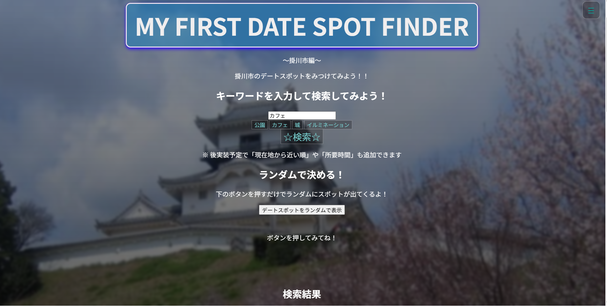
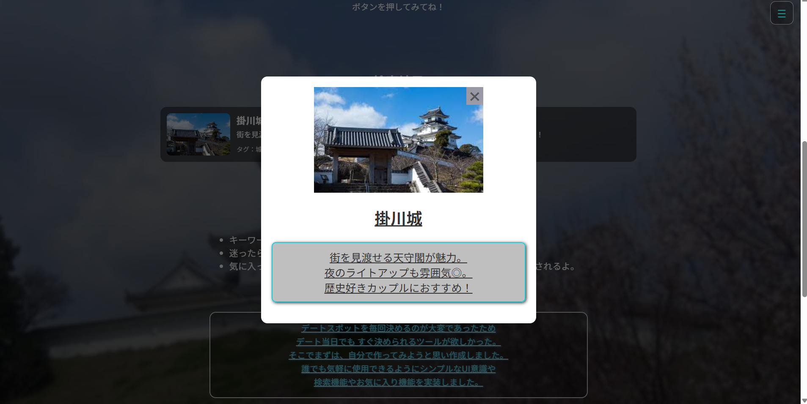
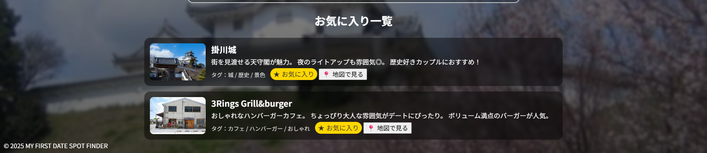

# MY FIRST DATE SPOT FINDER 〜掛川市版〜

**掛川市のデートスポットがすぐ決まる！**  
「どこ行く？」という毎回の悩みを減らせる Web アプリです。

---

## アプリ概要

| 項目 | 内容 |
|------|------|
| 種別 | ブラウザで動作するシングルページ Web アプリ |
| 技術 | HTML / CSS / JavaScript |
| フレームワーク | 不使用（DOM操作・イベント委譲・localStorage管理を自前実装） |
| 対象エリア | 静岡県掛川市 |

---

## コンセプト / 目的

デートで一番困るのは  
**「今日どこ行く？」が決まらない時間**。

- ざっくりキーワードで候補表示
- 迷ったらランダムで決定
- 気に入った場所はお気に入り登録
- そのまま **Google Map でルート確認**

**決める → 移動 → 楽しむ** の流れを止めない UX を目指して設計しました。

---

## 想定ユーザー

- 掛川市・周辺に住むカップル
- 掛川市の穴場スポットを見つけたい方
- 20〜30代で車/電車移動が多い層
- デートがマンネリ化してきた人
- その場で次のスポットをすぐ決めたい人

---

## 実装機能一覧

| 機能名 | 内容 |
|-------|------|
| 🔍 キーワード & カテゴリ検索 | 公園 / カフェ / イルミネーション などで検索可能 |
| ⭐ お気に入り登録 | Set + localStorage で高速 & 永続保存 |
| 🎲 ランダム表示 | 迷ったとき1クリックで候補を決定 |
| 📍 Google Map 連携 | 緯度経度があればピンポイント、無い場合は名称検索でフォールバック |
| 🖼 モーダル詳細表示 | カードクリックで詳細表示＆統一レイアウトの画像表示 |

---

## 技術的ポイント

- **Set** を用いて O(1) でお気に入り管理  
  → 高速参照＆UIと状態の分離
- **localStorage** による永続化  
  → アプリを閉じてもお気に入り継続
- **イベント委譲** (`document.addEventListener`)  
  → 動的生成要素にも確実に対応
- **Google Map 連携**  
  → 座標が無い場合でも名称検索で代替可能
- **UI/UX 改善**  
  - モーダル導入
  - `object-fit: cover` による画像比率統一
  - `white-space: pre-line` で説明文改行を自然に

※ JavaScript はまだ学習途中ですが、理解できなかった部分はメモで残し、  
後から振り返って理解を深められるように取り組みました。

---

## 各機能の使い方

### ① キーワード検索

テキストボックスへ入力し【☆検索☆】ボタンを押すと、  
条件に合うスポットが表示されます。

### ② ランダム決定

キーワードを考えるのが面倒なときに便利です。

### ③ 詳細モーダル表示

スポットカードをクリックすると詳細情報が見られます。

### ④ お気に入り & Google Map 連携

気になったスポットはお気に入り登録。  
地図ボタンからすぐ Google Map で場所確認できます。

---

## 今後の拡張予定

- 予算 / 所要時間 / 屋内外フィルタ追加
- 「行った場所」「超お気に入り」など感情ベースのステータス追加
- 掛川市 → 静岡県内 → 全国への拡張

---

## 開発の姿勢・学習方針

本アプリは当初、AI の補助を受けながら開発しましたが、

- **コードを読み返して構造理解**
- **エラーの原因調査と自力修正**
- **UI/UX 改善の自発的実装**

と進めていく中で、  
**「動くものを作る」→「理解して改善する」** へ意識が変化しました。

まだ JavaScript の理解は十分ではありませんが、  
メモを残しながら理解を深める習慣を続けています。

---

## 最後に

このアプリが、掛川のデートがもっと楽しくなる  
きっかけになれば嬉しいです。

**MY FIRST DATE SPOT FINDER**  
© 2025

